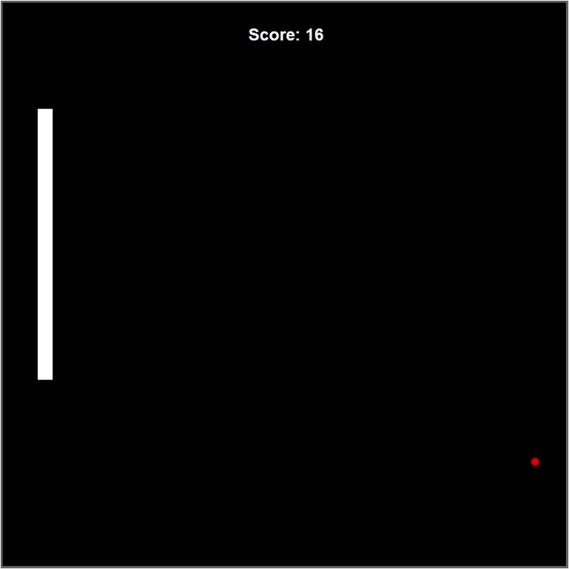

# snake-game 🐍

My first Python project — a classic Snake game built using OOP and Turtle graphics.
You can move the snake using the arrow keys and eat red food to grow your snake.

## 🎮 Game Preview

## Files

- `main.py`: The game loop
- `snake.py`: Controls the snake object
- `food.py`: Controls food appearance
- `score.py`: Scoreboard logic

## ✅ Features

- Move the snake with arrow keys
- Eat food to grow
- Score tracking
- Game Over screen

## 🧰 Technologies

- Python 3
- Turtle Graphics
- OOP principles

  ## How to Run

1. Make sure you have Python installed.
2. Run `main.py` from any Python IDE or terminal.
